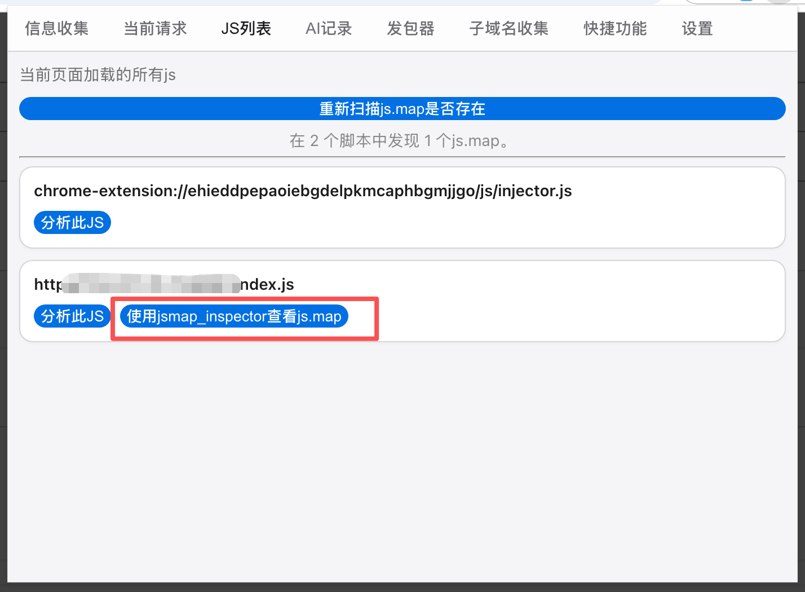
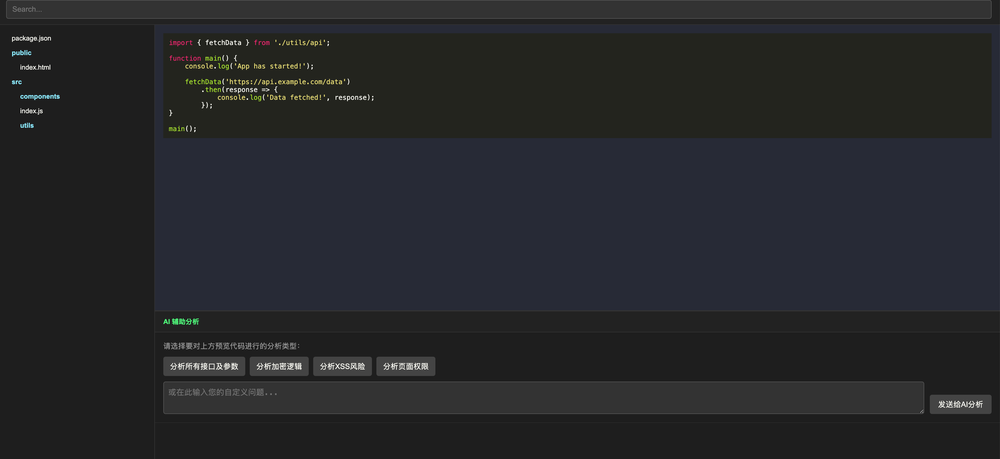
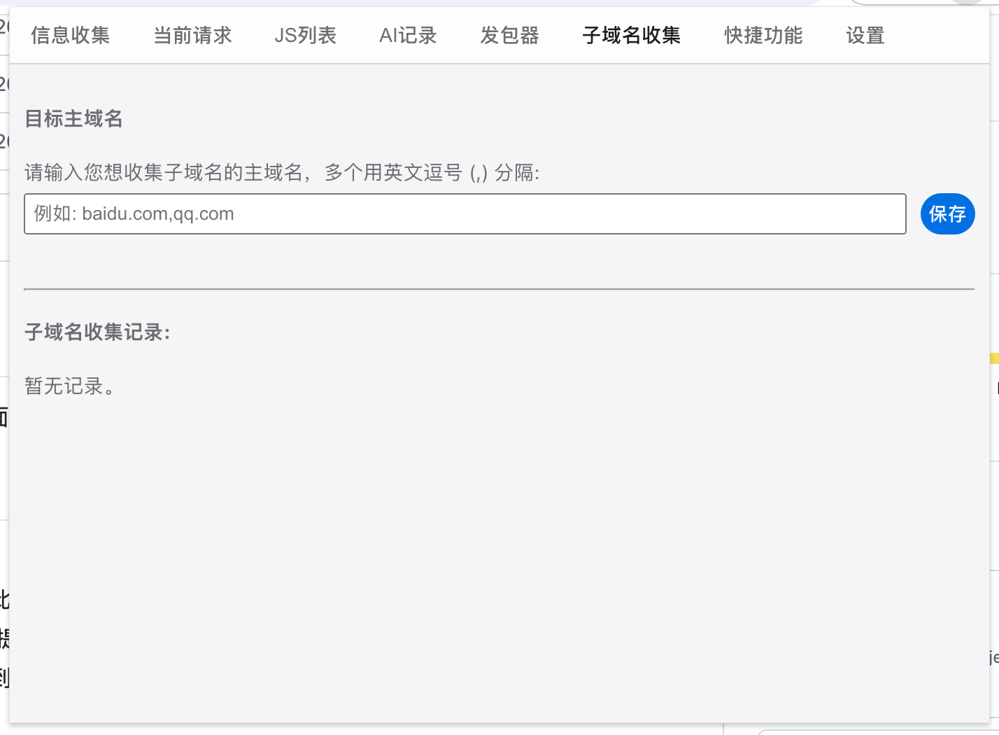
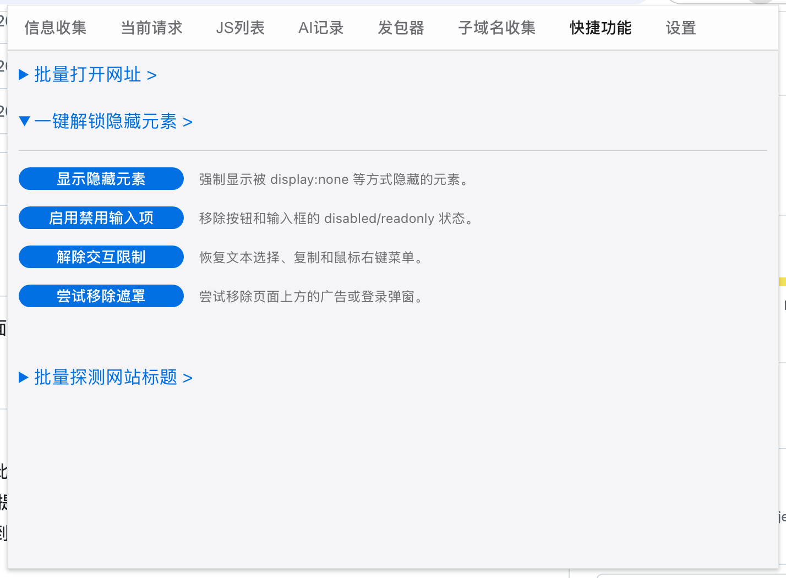

# Parsing

Parsing 是一个 Chrome 插件，选择ai分析当前页面的Js代码，内置提示词，不再需要单拎js。以及信息收集功能，提升渗透测试效率

## 功能

### 🤖 AI 代码审计引擎
利用多种AI大模型（Gemini, GPT-4o等）一键分析JS代码，挖掘API等。

### 🔬 资产与信息收集
自动扫描网页HTML和JS，提取API、IP、域名、密钥等敏感资产和技术指纹等。

### 🌐 网络逆向与监控
实时记录所有网络请求和JS加载，并能快速定位API在哪个脚本文件中定义。

### 🛡️ 一键未授权测试
提供一键未授权访问测试和批量主机存活探测功能。

### 🗺️ Source Map 工具
自动检查并帮助加载、查看JS文件的Source Map，辅助代码分析。

## 安装使用

1. 下载压缩包后解压，在chrome加载未打包的扩展程序。
2. 打开插件在设置页面配置apikey、白名单域名。

## 功能截图

### 接入jsmap_Inspector

    
    
    

### 当前请求

    
    

### js分析

    

### 信息收集

    
    

### Js列表

    

### AI记录

    

### 发包器

    

### 子域名收集

    

### 快捷功能

    

### 设置

    
 

### 感谢

jsmap.html来自https://github.com/ynsmroztas/jsmap_inspector 接入了ai分析接口  

信息收集部分规则来自https://github.com/SickleSec/SnowEyes
