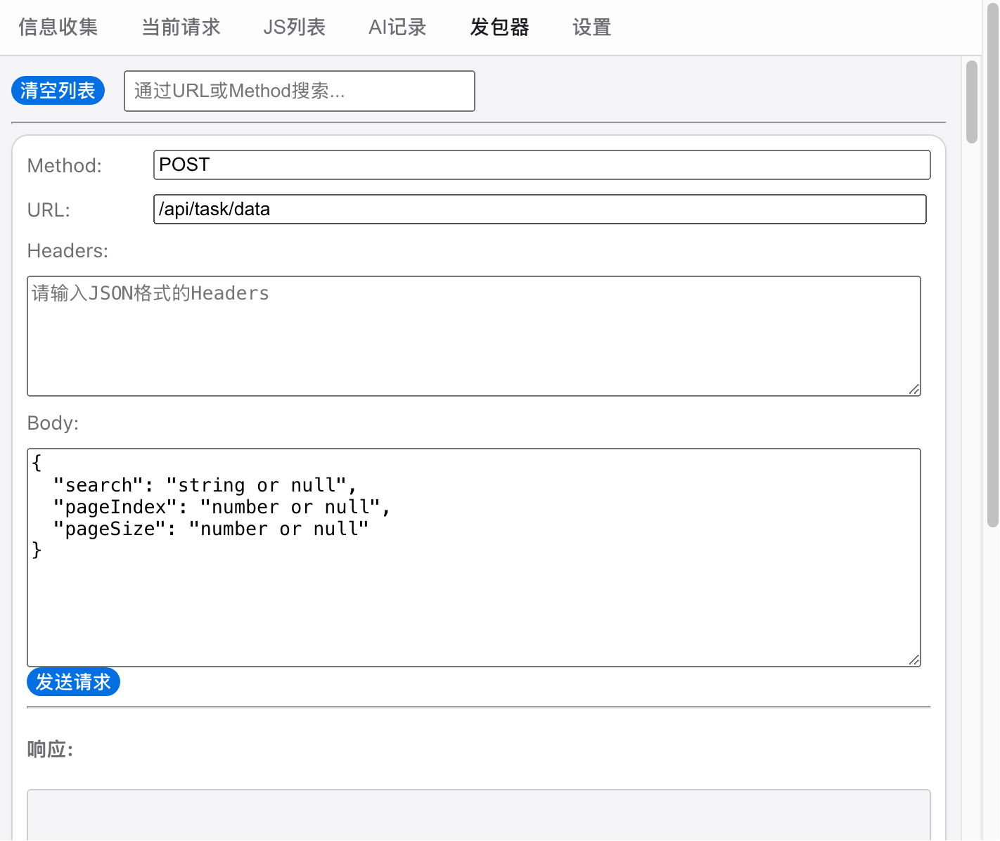

# Parsing

Parsing 是一个 Chrome 插件，用于解析当前页面的 JavaScript 代码，并提供多维度的 AI 分析功能。

## 功能

1. 非自动形式的js敏感信息扫描。
2. 截获当前页面的请求，并获取其来源js，以此选择性分析js源码。
3. 提供多种分析方式的快捷按钮，支持自定义提示词内容，多种ai模型的分析。
4. ai分析提取到的接口和参数，支持一键发送到发包器，发包器可更改参数，使用当前cookie一键发包。

## 安装使用

1. 下载压缩包后解压，在chrome加载未打包的扩展程序。
2. 打开插件在设置页面配置apikey、白名单域名。

## 功能截图

### 当前请求

    
    

### js分析

    

### 信息收集

    
    

### Js列表

    

### AI记录

    

### 发包器

    

### 设置

    
 

